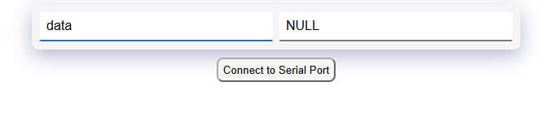

# SDDS (Self-Describing-Data-Structure)
A lightweight C++ library for event-driven applications with auto-generated user interfaces.

## Table of contents
- [Why use this library](#why-use-this-library)
- [Installation](#installation)
  - [Arduino IDE](#arduino-ide)
  - [PlatformIO](#platformio)
    - [Coding with PlatformIO](#coding-platformIO)
- [Example for this documentation](#example-for-this-documentation)
- [Coding the example](#coding-the-example)
  - [Defining the structure](#defining-the-structure)
  - [Reacting to state changes](#reacting-to-state-changes)
  - [Introducing Timers](#introducing-timers)
  - [Putting it all together](#putting-it-all-together)
- [Testing the Example](#testing-the-example)
  - [Build and Upload the code](#build-and-upload-the-code)
  - [Full Example Code](#full-example-code)
  - [Explore Serial Spike](#explore-serial-spike)
  - [Request the type description](#request-the-type-description)
  - [Subscribe to change notification](#subscribe-to-change-notification)
  - [Set values](#set-values)
  - [Save Parameters](#save-parameters)
- [Documentation](#documentation)
  - [The Data Structure (Tree)](#the-data-structure)
  - [Declaring variables](#declaring-variables)
  - [Calling functions with SDDS variables](#calling-functions-with-sdds-variables)
  - [Calling functions with SDDS enums](#calling-functions-with-sdds-enums)
  - [Data types](#data-types)
    - [Primitve types](#primitives)
    - [Time](#ttime)    
    - [Enums](#enums)
    - [Structs](#structs)
  - [Parameter Save](#parameter-save)
  - [Spikes](#spikes)
     - [Plain protocol](#plain-protocol)
     - [Serial Spike](#serial-spike)
     - [Web Spike](#web-spike)
     - [UDP Spike](#udp-spike)
  - [Interrupts](#interrupts)
     - [Guidelines](#interrupt-guidelines)
     - [Interrupts are evil](#interrupts-are-evil)
     - [How to use interrupts with SDDS](#how-to-use-interrupts-with-sdds)

- [Supported platforms](#supported-platforms)
- [Changes in the library](#changes-in-the-library)

- [Known Issues](#known-issues)
  - [Boards with AVR CPU's](#boards-with-avr-cpus)
    - [Reacting to state changes on AVR](#reacting-to-state-changes-on-avr)
- [How to contribute](#how-to-contribute)
  - [Write Documentation](#write-documentation)
  - [Help to organize the repository](#help-to-organization-of-the-repository)
  - [Code new Spikes](#code-new-spikes)
  - [Build SDDS Client application](#build-sdds-client-application)
  - [Develop components](#develop-components-for-our-public-component-library)
  - [Test and feedback](#test-and-give-feedback)

## Why use this library
In our opinion, one of the most annoying things in software development is that one has to spend more time providing ways to interact with the software compared to what the program actually does. The time needed to develop and test things like the following is massive:

* Communication protocols to control the software via:
  * Serial
  * Web
  * UDP
  * Displays
* Save parameters to non-volatile memory

The purpose of this library is to get rid of all that and focus on what's really important: the functionality that has to be implemented. This is done by completely separating the business logic and providing standard interfaces. This way, all the points mentioned above have to be done only once in a generic way for all of our projects in what we call [Spikes](#spikes). If you are not sure what we are talking about, check out our [Coding a full-featured WiFi Manager in 120 lines](https://github.com/mLamneck/SDDS_ESP_Extension?tab=readme-ov-file#coding-a-full-featured-wifi-manager-in-120-lines) where we showcase how you can tremendously speed up your development process with SDDS.

Another goal of this library is to keep it as simple as possible. We want to declare and use variables like we are used to in regular C++, but gain the benefits of Runtime Type Information (RTTI) and self-generating user interfaces on the other hand for free.


## Installation

### Arduino IDE
Clone this repository into your library folder, and you are ready to go. If you want to use ESP-only features like [web spikes](#web-spike), you also need to install the [ESP Extension](https://github.com/mLamneck/SDDS_ESP_Extension).

### PlatformIO
[PlatformIO](http://platformio.org) is an open source ecosystem for IoT development with cross platform build system and library manager. It works on the popular host OS: Mac OS X, Windows, Linux 32/64, Linux ARM (like Raspberry Pi, BeagleBone, CubieBoard).

1. Install [PlatformIO IDE](http://platformio.org/platformio-ide)
2. Create new project using "PlatformIO Home > New Project"
3. Add "SDDS" to project using [Project Configuration File `platformio.ini`](http://docs.platformio.org/page/projectconf.html) and [lib_deps](http://docs.platformio.org/page/projectconf/section_env_library.html#lib-deps) option:

```ini
[env:teensy31]
platform = teensy
board = teensy31
framework = arduino
lib_deps = https://github.com/mLamneck/SDDS.git
```
4. PlatformIO has a built-in serial monitor. However, it's missing the ability to send messages so far. If you want to use it as you are used to in Arduino IDE, you can install [this](https://marketplace.visualstudio.com/items?itemName=ms-vscode.vscode-serial-monitor) extension.
5. Happy coding with PlatformIO!

If you want to use ESP-only features like [web spikes](#webspike) you want to add the [Esp Extension](https://github.com/mLamneck/SDDS_ESP_Extension) instead. This will automatically add the SDDS core library.

```ini
[env:d1_mini_lite]
platform = espressif8266
board = d1_mini_lite
framework = arduino
lib_deps = https://github.com/mLamneck/SDDS_ESP_Extension.git
```
<!-- declaring unique labels with anchor tags  -->
#### <a id="coding-platformIO"></a> Coding with PlatformIO
We provide some useful snippets to further speed up your development process and avoid typing errors. Just place the file [code snippets](examples/platformIO/led/.vscode/sdds.code-snippets) in your `.vscode` folder.

<p align="center">
  
</p>


## Example for this documentation

The topic addressed by this document is fairly abstract. That's why we provide a simple example that will be used throughout the document to show the connection to a real-world scenario. For this purpose, we want to use an advanced LED blinking code with the following features:
1. Turn the board's LED on/off.
2. Enable/disable blinking of the LED.
3. Adjust the time the LED is on/off when blinking.
4. Save settings to non-volatile memory to be available again after restarting the board.

We use the serial console to trigger/control features. On ESP-based boards, it's possible to use the smartphone as well.
    
## Coding the example
If you'd like to have a look at the final implementation, jump to the [Testing the Example](#testing-the-example) section right away.

Otherwise, let's start by defining the data structure for our example. We need the following:

| Name           	  | Possible Values  	|
|:-------------		  |:-----			        |
| ledSwitch 	  	  | ON, OFF 		      |
| blinkSwitch 	  	| ON, OFF 	      	|
| onTime/offTime  	| 100-10000 		    |

### Defining the structure
```C++
#include "uTypedef.h"
#include "uMultask.h"

sdds_enum(OFF,ON) TonOffState;

class Tled : public TmenuHandle{
  public:
	sdds_var(TonOffState,ledSwitch,sdds::opt::saveval)
	sdds_var(TonOffState,blinkSwitch,sdds::opt::saveval)
	sdds_var(Tuint16,onTime,sdds::opt::saveval,500)
	sdds_var(Tuint16,offTime,sdds::opt::saveval,500)

    Tled(){
        pinMode(LED_BUILTIN, OUTPUT);

        //process logic goes here
    }
};
```
We start with the necessary includes followed by an enum definition. Next, we define the necessary process variables for our example by deriving a class from `TmenuHandle` provided by the library. Note the only special thing here is the use of `sdds_var`. It has 4 parameters while the last 2 are optional.

`sdds_var(dtype,name[,option,defaulValue])`
1. Data Type
2. name (to be used it the code)
3. option (readonly, saveval, showhex, ...)
4. default value

We will proceed with the logic for the LED handling in the constructor of this class.

### Reacting to state changes
So far, we have defined our data structure. For the moment, just assume that it would be possible to change the value of the variable `ledSwitch` with a smartphone. We need a way to react to that change, i.e., turn the LED on or off. Of course, we could periodically check the value, but we don't like polling, do we? There's a much better way to do it:
```C++
...
Tled(){
  ...
  on(ledSwitch){
    if (ledSwitch == TonOffState::ON) digitalWrite(LED_BUILTIN,1);
    else digitalWrite(LED_BUILTIN,0);
  };
}
```
This can be read like this: if the value of `ledSwitch` is written, execute the code in curly braces, and this code finally turns the LED on/off depending on the value of `ledSwitch`. 

If you are using a board with an AVR CPU, please read [known issues with AVR](#reacting-to-state-changes-on-avr) first.


### Introducing Timers

Now we have a basic setup and we can switch the LED, but in order to implement blinking of the LED, we need a mechanism for timing. Without further ado, let's have a look at the final code:

```C++
#include "uTypedef.h"
#include "uMultask.h"

sdds_enum(OFF,ON) TonOffState;

class Tled : public TmenuHandle{
    Ttimer timer;	//this is added
    public:
      sdds_var(TonOffState,ledSwitch,sdds::opt::saveval)
      sdds_var(TonOffState,blinkSwitch,sdds::opt::saveval)
      sdds_var(Tuint16,onTime,sdds::opt::saveval,500)
      sdds_var(Tuint16,offTime,sdds::opt::saveval,500)

      Tled(){
          pinMode(LED_BUILTIN, OUTPUT);

          on(ledSwitch){
              if (ledSwitch == TonOffState::ON) digitalWrite(LED_BUILTIN,1);
              else digitalWrite(LED_BUILTIN,0);
          };

          // code from here is new
          on(blinkSwitch){
              if (blinkSwitch == TonOffState::ON) timer.start(0);
              else timer.stop();
          };

          on(timer){
              if (ledSwitch == TonOffState::ON){
                  ledSwitch = TonOffState::OFF;
                  timer.start(offTime);
              } 
              else {
                  ledSwitch = TonOffState::ON;
                  timer.start(onTime);
              }
          };
      }
};
```

Note the added definition of the `Ttimer` at the top of the class. Just like we did with `ledSwitch`, we defined an event handler for our `blinkSwitch`. If the switch is on, it just starts the timer with the value of 0, which basically means elapse as soon as you can. If the switch is off, we just stop the timer. And how do we react to the elapsed timer? Just like we do with all state changes: `on(timer){...}`. Here we just toggle the LED and start the timer with the corresponding value.

### Putting it all together

Now that we have a fully functional component, we can use it, for example, in an Arduino Sketch:

```C++
#include "uTypedef.h"
#include "uMultask.h"
#include "uParamSave.h"

//...
//your Tled component
//...

class TuserStruct : public TmenuHandle{
    public:
        sdds_var(Tled,led)
        sdds_var(TparamSaveMenu,params)

        TuserStruct(){
            //you application code goes here... 
        }
} userStruct;

#include "uSerialSpike.h"
TserialSpike serialHandler(userStruct,115200);

void setup(){

}

void loop(){
  TtaskHandler::handleEvents();
}
```

There are some things to note here:

* We nested the LED component in another class called `userStruct`. This is not necessary. We could instead just declare `Tled led` and replace all occurrences of `userStruct` with `led`. Usually, you will have multiple components and one root structure collecting them. But it's completely up to you.
* Another reason to nest the `Tled` component is that we've implemented the parameter save right away. We promised to implement a parameter save, right? That's done by simply including the `TparamSaveMenu` somewhere in your tree. You will see it in action in the testing section.
* The call to `TtaskHandler::handleEvents()` in the loop is necessary to run the event handler.
* The declaration of `TserialSpike` makes the structure accessible over serial communication. And that's the beauty of it. You don't have to touch your LED component to make it available. And it doesn't matter if you add/remove variables to your LED or if you add more components. The same holds true for the parameter save.

## Testing the Example
It's time to finally play around and have fun...

### Build and Upload the Code
If you are using Arduino IDE, you can just open the example.

If you choose to test with PlatformIO, you can download the full example project [here](/examples/platformIO/led/). Also make sure to install an extension for the serial monitor as explained in the [installation](#platformio) chapter.

```File->Examples->SDDS->Led```
### Full Example Code
You can also copy and paste the following complete example.

```C++
#include "uTypedef.h"
#include "uMultask.h"
#include "uParamSave.h"

sdds_enum(OFF,ON) TonOffState;

class Tled : public TmenuHandle{
    Ttimer timer;
    public:
        sdds_var(TonOffState,ledSwitch,sdds::opt::saveval)
        sdds_var(TonOffState,blinkSwitch,sdds::opt::saveval)
        sdds_var(Tuint16,onTime,sdds::opt::saveval,500)
        sdds_var(Tuint16,offTime,sdds::opt::saveval,500)

        Tled(){
          pinMode(LED_BUILTIN, OUTPUT);

          on(ledSwitch){
              if (ledSwitch == TonOffState::ON) digitalWrite(LED_BUILTIN,0);
              else digitalWrite(LED_BUILTIN,1);
          };

          on(blinkSwitch){
              if (blinkSwitch == TonOffState::ON) timer.start(0);
              else timer.stop();
          };

          on(timer){
              if (ledSwitch == TonOffState::ON){
                  ledSwitch = TonOffState::OFF;
                  timer.start(offTime);
              } 
              else {
                  ledSwitch = TonOffState::ON;
                  timer.start(onTime);
              }
          };
      }
};

class TuserStruct : public TmenuHandle{
  public:
    sdds_var(Tled,led)
    sdds_var(TparamSaveMenu,params)
  
    TuserStruct(){
        //you application code goes here... 
    }
} userStruct;

#include "uSerialSpike.h"
TserialSpike serialHandler(userStruct,115200);

void setup(){

}

void loop(){
  TtaskHandler::handleEvents();
}
```

### Explore Serial Spike

The serial spike uses the [Plain protocol](#plain-protocol) specified in the documentation to populate the data structure we've built over the default serial. With this, we can use client applications that understand this protocol to build a generic user interface based on the variables we have used in our code. A simple example of such an application is our **sddsMinimalBrowser** from [this](https://github.com/mLamneck/SDDS_minimalBrowser) repository. We will use it in this chapter. First of all, download the file **sddsMinimalBrowser.html** from [here](https://github.com/mLamneck/SDDS_minimalBrowser/tree/main/release). Open it in your browser (Chrome, Opera, or Edge). It will look like the following.

<p align="center">
  
</p>

The first step is to connect to the serial port, associated with the device you are using.
* Make sure the port is not blocked by another application (serial monitor, upload process, ...).
* Click on *Connect to Serial Port*.
* In the upcoming dialog, select the port associated with your device and click on connect.


<p align="center">
  
</p>


After the connection has been established, it will look like this:

<p align="center">
  
</p>

Congratulations! You have successfully connected to your device. Now it's time to play around. For example, you could try the following. If you don't know what we mean by setting `led.ledSwitch=ON/OFF` or you don't know how to do it, we have some guidelines on how to use this application [here](https://github.com/mLamneck/SDDS_minimalBrowser?tab=readme-ov-file#introducing-the-user-interface).

* **Switch the LED ON/OFF** set `led.ledSwitch=ON/OFF`
* **Let it Blink!** set `led.ledSwitch=ON/OFF`
* **Adjust the blink interval!** set `led.onTime/offTime=1000` (don't go crazy with low values, because we didn't account for this in our simple code). Note how you get live updates from `led.ledSwitch` as well.
* **Save the current settings** set `params.action=save`

After saving the settings, you can restart the device and you should find it blinking with the same settings. While this is just a very simple example application, it's still very useful to have the ability to monitor and adjust all the variables of your program without any additional effort.

If you want to go more in depth on how this works behind the scenes, you can continue with the next chapter or jump to the [documentation](#documentation).

### Explore Serial Spike - in depth

We want to point out here that the following section is not how it's supposed to be used. It still makes sense to check out the following instructions to get an idea of how spikes work under the hood. So let's walk through...

1. Build and upload the code to your board.
2. Open the Serial Monitor (default baudrate 115200).
   
#### Request the type description
3. Send the command ```T```.
    * The response will look like the following. It's a full description of the data structure you have declared within your code, including types, options and possible values for enums. This information can be used by software to build a generic user interface like showcased with the [SDDS-Minimal-Browser](https://github.com/mLamneck/SDDS_minimalBrowser). For now, let's continue to explore the fundamentals in the serial monitor.
     
       ```t 0 [{"type":66,"opt":0,"name":"led","value":[{"type":49,"opt":0,"name":"ledSwitch","value":"OFF","enums":["OFF","ON"]},...```

	   ```t 0 {"e":{"0":["OFF","ON"],"1":["___","save","load"],"2":["___","crc","invStrLen","outOfMem","invVers"]},"d":[[66,0,"led",[[49,128,"ledSwitch",0],[49,128,"blinkSwitch",0],[2,128,"onTime"],[2,128,"offTime"]]],[66,0,"params",[[49,0,"action",1],[49,0,"error",2],[2,0,"size"],[4,0,"time"]]]]}``` 
    
      Without specifying a path after the ```T```, you get the whole data structure. You can also ask more specifically, i.e., ```T led```, which will give you the description of the component we've created. You can also specify an arbitrary number after the `T`, i.e., `T 88 led`, if you want to do multiple requests without waiting for the individual responses. If you do not specify a number, you will find a `0` in the response like in the above example.


#### Subscribe to change notification

4. Send the command ```L 1 led```.
   * This command is used to subscribe to the LED structure, so that whenever a value changes, we get a notification in the serial console. If you wonder about the "parameter" `1`, it is an arbitrary number that will be in the same place in the response to associate it with the request. You need this if you subscribe to multiple structures at the same time in order to read the data in the right struct when processing the response. The initial response contains basically all values from our `Tled` structure:


     ```l 1 0 ["OFF","OFF",500,500]```

#### Set Values
5. Use the command ```led.ledSwitch=0/1``` or ```led.ledSwitch=OFF/ON``` to turn the LED off/on.
   * Because we have previously subscribed to get change notifications in step 4, we receive a notification as a result. If we have skipped step 4, we wouldn't get any response, but the LED would still turn on/off.

     ```
     l 1 0 ["OFF"]
     l 1 0 ["ON"]
     ```
     
6. Use the command ```led.blinkSwitch=0/1``` or ```led.blinkSwitch=OFF/ON``` to enable the automatic LED toggle.
    * Again because of our subscription initiated in step 4, we first get a change notification of the blinkSwitch and the ledSwitch in the first line of the response and later on we get notifications every time the LED turns on/off.

      ```
      l 1 0 ["OFF","ON"]
      l 1 0 ["ON"]
      l 1 0 ["OFF"]
      l 1 0 ["ON"]
      l 1 0 ["OFF"]
      ```

7. Feel free to play with `led.onTime`/`offTime` as you like...
8. You can also try to unsubscribe from notifications with the command "U 1" and try if the set commands still work.

#### Save Parameters
9. Let's try to save parameters. Turn on the periodic blinking of the LED. Enter the command ```L 2 params``` to enable change notifications for the params menu. This is not necessary, but in order to see a response, we better do it. Here we use `2` as a second parameter to keep the subscription established in step 4 alive. If we choose to go for `1`, it will automatically unsubscribe from the `led` structure. Enter ```params.action=save``` in the serial console. The response will look something like the following.


 ```
l 2 0 ["___","___",8]
 ```

The first ```___``` is the action variable which you have set to ```save``` with your command. This triggers the save of the menu and when the command is done, it is set back to ```___``` by the `TparamSaveMenu` component. The second ```___``` means no error occurred and the third value is the number of bytes that have been saved to the non-volatile memory, in this case 8 (2x1 byte for the ledSwitch/blinkSwitch, 2x2 bytes for on/offTime, and 2 bytes for internal management). Read more about [Parameter Saving](#parameter-save) in the Documentation.

## Documentation

As always, when time is a limiting factor, you keep things like documentation and unit testing short in order to be productive. However, the best library is useless without proper documentation. We do our best in the following chapters to address the most important things. Regarding unit tests, there are a few for critical functionalities, and we hope to find some developers with experience in this field to help us do a better job.

### The Data Structure
In the middle of SDDS, there is a global self-describing data structure organized in a hierarchy called the tree. This tree is the only interface needed. You have to change your mindset from API-driven interfaces, where you have a set of functions and methods you need to call. In SDDS, everything is done by manipulating variables. Typically, you organize your program into components. A component is a sub data structure within the global tree combined with some functionality. Our [Tled](#introducing-timers) class from the Example chapter is such a component. It's responsible for managing the board's LED state. It's the master of the LED if you want. Instead of calling a function to turn the LED on/off or let it periodically toggle (which would be complicated unless you'd use some library like FreeRTOS to do it in a task), you change the value of the LED fields: 
```
led.blinkSwitch=1
```
On the other hand, you can always react to changes of variables in the tree by using the statement.
```C++
on(led.blinkSwitch){ 
	//some code executed on state change
};
```
Another example which is more focused on producing data would be a readout of the ADC. It could probably look like this:
```C++
class Tadc : public TmenuHandle{
    Ttimer timer;
    public:
        sdds_var(Tuint16,value,sdds::opt::readonly)
        sdds_var(Tuint8,pin,sdds::opt::saveval)
        sdds_var(Tuint16,readInterval,sdds::opt::saveval,100)

        Tadc(){
          on(pin){
			//check pin to be a valid pin...
            pinMode(pin, INPUT);
            timer.start(0);
          };

          on(timer){
            value = analogRead(_pin); 
            timer.start(readInterval); 
          };
        }
};
```
The beauty of this is that this code is completely separated from the rest of your code. It's responsible for one thing: to read out the ADC with a given, adjustable interval and pin. You don't care who gets notified of a change in the ADC value nor who is setting the readInterval. There could be 10 clients subscribed due to different communication channels or none. And if nobody's interested in the ADC value, the line
```C++
value = analogRead(_pin); 
```
just sets the value in memory instead of sending it uselessly to the serial console or some websocket, UDP, or whatever. The library takes care of it for you. Imagine it like a secretary. You give the data structure and say: "Hey look, this is my structure. Please provide it for everybody interested in it and please notify me if somebody is changing the value of the variable 'pin'." The variable "value" is read-only, so nobody from outside of this machine is allowed to change it. The variables "pin" and "readInterval" should be stored to a non-volatile memory if a save is triggered. Now some code on the same machine could do something like this.
```C++
  ...
  //within another component
  on(adc0.value){
    if (adc0.value > 2000){
	//turn off something here.
    }
  }; 
```
This is an example of a component on the local machine being a client and reacting to state changes. For clients outside of the machine, we use what we call [Spikes](#spikes) illustrated in the documentation.

### Declaring Variables

In SDDS, variables are declared using `sdds_var(dtype, name[, option, defaultValue])` inside a class derived from `TmenuHandle`, i.e.
```C++
class TuserStruct : public TmenuHandle{
    sdds_var(Tuint8,cnt);
    sdds_var(Tfloat32,someValue);
        //...
};
```
You will always group variables that belong together in such a structure and add some functionality to form a component. The macro `sdds_var` has four parameters, while the last two are optional.

1. Data Type (A list of available types can be found [here](#data-types))
2. name (to be used in the code)
3. option (readonly, saveval, showhex, ... use `sdds::opt::` for autocompletion; multiple options can be combined with a logical OR, or preferably with `sdds_joinOpt(opt1,opt2,...)`)
4. default value

### Calling Functions with SDDS Variables

When passing variables declared with `sdds_var(...)`, there is nothing special to take care of. You can pass a variable by value or reference like you would do in regular C++. However, there are some things to note. Consider the following code:
```C++
void incByValue(Tuint8 _val){
    _val++;
}

void incByValueMoreEfficient(Tuint8::dtype _val){
    _val++;
}

void incByRef(Tuint8& _val){
    _val++;
}

class TuserStruct : public TmenuHandle{
    public:
        sdds_var(Tuint8,cnt);

        TuserStruct(){
            on(cnt){
                debug::log(cnt.to_string().c_str());
            };
            
            //this will log 1
            cnt = 1;

            //this won't log anything
            incByValue(cnt);
            incByValueMoreEfficient(cnt);

            //this will log 2
            incByRef(cnt);
        }
} userStruct;
```
Here we have declared one variable called `cnt` of type `uint8`. We install an event handler (`on`) to log any write access. We first set it to `1` and then pass the variable to 3 different functions. All functions just increment the given value by 1. The first 2 functions are:
- `incByValue(Tuint8 _val)`
- `incByValueMoreEfficient(Tuint8::dtype _val)`

They receive the variable `_val` by value (a copy of it). The main difference between the two is that the first one receives a copy of an object which controls the access to the underlying datatype, i.e., uint8, while the latter one takes the underlying data type uint8 directly. It's not much of a difference. In the first case, a copy constructor has to be called, which just makes a copy of the underlying data type. However, it uses more stack because it has to create a copy of the object `cnt`, which is not necessary here. So if you want to have it most efficient, use the latter one, but it's not much of a difference. Instead of `Tuint8::dtype`, you could use `uint8_t`, but it's neat to use it like this. Note that even though the first function receives a copy of the object, no event handlers (`on`) will be called.

The third function `void incByRef(Tuint8& _val)`, as expected, receives a reference to the variable and thus modifying the value has the same effect as it would outside of the function.


### Calling Functions with SDDS Enums

The usage of enums as function arguments is basically the same. But there is more to say. Again, consider the following code. Note the line:

`_enum = _enum == TonOff::off ? TonOff::on : TonOff::off;`

This line is just toggling the enum's value if you are not familiar with this C++ syntax.
```C++
sdds_enum(on,off) TonOff;

void changeEnumByVal(TonOff _enum){
    _enum = _enum == TonOff::off ? TonOff::on : TonOff::off;
}

void changeEnumByValMoreEfficient(TonOff::dtype _enum){
    _enum = _enum == TonOff::off ? TonOff::on : TonOff::off;
}

void changeEnumByRef(TonOff& _enum){
    _enum = _enum == TonOff::off ? TonOff::on : TonOff::off;
}

void passEnumConstAndLog(TonOff::dtype _enum){
    debug::log(TonOff::c_str(_enum));
}

class TuserStruct : public TmenuHandle{
    public:
        sdds_var(TonOff,mySwitch)

        TuserStruct(){
            on(mySwitch){
                debug::log(mySwitch.c_str());
            };

            //this will log "on"
            mySwitch = TonOff::on;

            //won't lof something
            changeEnumByVal(mySwitch);
            changeEnumByValMoreEfficient(mySwitch);

            //this will log "off"
            changeEnumByRef(mySwitch);

            //this will log "off" again
            passEnumConstAndLog(TonOff::off);
        }
} userStruct;
```
Note how handy it is to log the state of the enum as readable text, i.e., "on" or "off," instead of 0 or 1. This would be impossible with a built-in C++ enum. The usage of the first 3 functions:

- `changeEnumByVal(mySwith)`
- `changeEnumByValMoreEfficient(mySwitch)`
- `changeEnumByRef(mySwitch)`

is equivalent to the functions described for the more primitive values [here](#calling-functions-with-sdds-variables). However, you might come across the need to pass an enum constant to a function and log its value in readable text as well. The problem is that in this case, the function receives a pure C++ class enum, and as described earlier, it's impossible to get the string representation out of an enum's value in C++. However, because we created a SDDS enum class, we can use it to do the translation:
```C++
void passEnumConstAndLog(TonOff::dtype _enum){
    debug::log(TonOff::c_str(_enum));
}
```
The `TonOff:dtype` in the parameter definition translates into the underlying datatype: 

```C++
enum class internalName {off,on}
```
However, the `TonOff` type we have declared with `sdds_enum` is smart enough to translate values back to their string representation using its class method.

```C++ 
TonOff::c_str(_enum)
```
This can be very useful for status or error reports. We use this, for example, internally in the [plain protocol handler](#plain-protocol) for error responses. This way, we can send the error code along with a more readable description. See the following example from our library.


```C++
//defined in uPlainCommErrors.h
namespace plainComm{
    sdds_enumClass(Terror
        ,___
        ,portParseErr   //1
        ,pathNotFound   //2
        ,pathNoStruct   //3
        ,pathNullPtr    //4
        ,invPort        //5
        ,invFunc        //6
    )
}

//...

//somewhere in uPlainCommHandler.cpp
bool TplainCommHandler::sendError(Terror::e _errCode, Tport _port){
    Fstream->write("E ");
    Fstream->write(_port);
    Fstream->write(' ');
    Fstream->write(plainComm::Terror::ord(_errCode));
    Fstream->write(' ');
    Fstream->write(plainComm::Terror::c_str(_errCode));
    Fstream->flush();
    return false;
}

//...

sendError(Terror::e::pathNotFound,Fport);
//For a given Fport 12 this will create the following error msg.
//E 12 2 pathNotFound
```

Note that we use the more primitive `sdds_enumClass` instead of `sdds_enum` because we don't need to store it in a struct. Instead, we only pass const values to a function.


### Data Types
SDDS provides primitive types as well as composed types and enums.

#### Primitives
We support the usual primitive data types as displayed in the following table. The TypeID field is what you see as the type fields in the response of the ```T``` command.

| Type      | TypeID/hex  | TypeID/dec  | Min           | Max           |
| -         | :-:         | :-:         | -----------:  | -----------:  |
| Tuint8    | 0x01        | 1           | 0             | 255           |
| Tuint16   | 0x02        | 2           | 0             | 65535         |
| Tuint32   | 0x04        | 4           | 0             | 4294967295    |
| Tint8     | 0x11        | 17          | -128          | 127           |
| Tint16    | 0x12        | 18          |-32768         | 32767         |
| Tint32    | 0x14        | 20          |-2147483648    | 2147483647    |
| Ffloat32  | 0x24        | 36          | -3.40282e+38  | 3.40282e+38   |
| Ffloat64  | 0x28        | 40          | -1.79769e+308 | 1.79769e+308  |


#### Other Types

| Type      | TypeID/hex  | TypeID/dec  |
| -         | :-:         | :-:         |
| Ttime     | 0x06        | 6           |
| Tstring   | 0x81        | 129         |
| Tstruct   | 0x42        | 66          |
| Enum      | 0x31        | 49          |

#### Ttime
Internally, time is stored in a `timeval` structure with microsecond resolution, and you can work with it using the corresponding functions from the C library. The `stringToTime` function is used to parse values provided as strings into the internal structure. The following formats are valid:

- Date and Time
  - "28.11.2023 19:12:30"
  - "28.11.2023 19:12:30.765"
  - "01.01.1970T19:12:30"
  - "05/30/2020 19:12:30"
- Date
  - "10.10.2023"
- Time
  - "19:12:30"

You can use this function to provide default values for a `Ttime` variable.

```C++
sdds_var(Ttime,myTime,0,stringToTime("28.11.2023 19:12:30"))
```

#### Strings
There's not much to say about strings. Under the hood, a dynamic string representation is used. However, the parameter save is limited to a 255-byte length.

#### Enums
If you don't know about enums, it is basically an integer type that has a more readable representation. This is, for example, useful for status variables.

```C++
sdds_enum(on,off) TonOffState;
...
class TmyComponent : public TmenuHandle{
  sdds_var(TonOffState,mySwitch)
};
```
this declaration is the equivalent to C++ builtin `class enum` like
```C++
enum class TonOffState {on,off};
...
class TmyComponent{
  TonOffState mySwitch;
};
```
However, it is much more powerful because of the capability to translate the numeric value back into its string representation, which is impossible in native C++. Read more about the usage of enums [here](#calling-functions-with-sdds-enums).

#### Structs
Structs are a collection of primitive values bundled together. Structs can be nested to form the [tree](#the-data-structure). You can also derive a struct from a base struct.

```C++
//declare a struct
class TmyStruct : public TmenuHandle{
    sdds_var(Tuint8,cnt);
    sdds_var(Tuint32,max);
};

//nest within another struct
class TrootStruct : public TmenuHandle{
    sdds_var(TmyStruct,myStruct);
};

//derive from TmyStruct and add a time variable
class TderivedStruct : public TmyStruct{
    sdds_var(Ttime,time);
};
```

### Parameter Save
In most applications, you will find the need to store some of the parameters you are using to a non-volatile memory to be available after a restart. In SDDS, this is quite simple. Just specify the `saveval` flag in the option when declaring a variable and include the built-in `TparamSaveMenu` somewhere in your [tree](#the-data-structure), and you are ready to go. This way, whenever you trigger a parameter save (`params.action=save`), all parameters you have flagged for save are stored and automatically reloaded after a power-up. A full example can be found in the [Putting it all together section](#putting-it-all-together).

#### Changes in Structure
You can always add/remove variables or restructure your components. Just be aware that you probably lose your saved values after you change the tree. You can use the `T` command to retrieve the current state of your tree before you flash a new version to have a copy of your old version.

Values from the tree are saved binary so when you change something, this can lead to weird values when loading. Therefore, we are calculating a checksum of the tree and only execute a param load when the stored checksum matches the one of your tree. To build the checksum, we only use the types and not the names. So it's possible to change names without losing your config.

Parameters will not be loaded under the following circumstances:
* the type of a saved variable has changed
* the order of saved variables has changed
* variables flagged with `saveval` are added
* variables flagged with `saveval` are removed

Parameters will still load even if you:
* change the name of a saved variable
* add variables not flagged for save
* remove variables not flagged for save

#### Size in the Non-volatile Memory
The size required for the parameter save is basically the binary size of all the variables that have to be saved plus 2 bytes for the checksum and a version number.

After a save/load of parameters, you will find the used space in the size variable of the `TsaveParamsMenu`.

### Spikes

As mentioned before, in the middle of SDDS is the [tree](#the-data-structure). An interface that can populate this data structure over a communication channel like *serial* or a *websocket* is what we call a spike. It needs 2 things:
* a protocol
* a communication channel

#### Plain Protocol
The plain protocol is a human-readable format. All commands are terminated with a `\n`. 

The most obvious commands are to simply read and write values.
```C++
  led.blinkSwitch         //replies with led.blinkSwitch=ON/OFF
  led.blinkSwitch?        //replies with led.blinkSwitch=ON/OFF
  led.blinkSwitch=ON      //set the value. No reply
  led.blinkSwitch=1       //set the value. No replpy
```

For more advanced usage, we need the following:
 * retrieve type information
 * (un)subscribe to change notifications
 * error handling

Find a list of all available commands in the following table.

| Type            | Func | Port | Data           | Example |
|-----------------|------|------|----------------|---------|
| Type request    | T    |  %d+ | Path           | T 11 led |
| Type answer     | t    |  %d+ | JSON           | T 11 {"d":[[1,0,"value"],...} |
| Link request    | L    |  %d+ | Path           | L 33 led |
| Link answer     | l    |  %d+ | First \| JSON  | l 33 0 [1,1.4,"stringVal",...] |
| Unlink request  | U    |  %d+ | -              | U 3 |
| Unlink answer   | u    |  %d+ | -              | u 3 |
| Error           | E    |  %d+ | Error string   | E 5 invPort |
| Boot notify     | B    |  0   | -              |

You can find the error codes in the [source file](src/uPlainCommErrors.h).


#### Serial Spike

The Serial Spike uses the [plain protocol](#plain-protocol) to publish the data over the default serial.

#### Web Spike

The Web Spike does actually 2 things:
* It uses the [plain protocol](#plain-protocol) to publish data over websockets.
* It provides a website with a generic UI to interact with the data.
Web Spikes are only available on ESP platforms with the [SDDS_ESP_EXTENSION](https://github.com/mLamneck/SDDS_ESP_Extension).

#### UDP Spike

At the moment not implemented for ESP. We use it for debugging when running SDDS on Windows with MinGW.

#### Vbus Spike

The vbusSpike aims to implement efficient communication and distribution of self-describing data structures in distributed systems and embedded applications using a binary protocol. More information can be found in the repository [vbusSpike](https://github.com/mLamneck/SDDS_vbusSpike).


#### Text Display Spike
The Text Display Spike allows displaying and editing self-describing data structures on an LCD screen. It provides a simple and intuitive text-based interface for interacting with the data, making it accessible in embedded environments without requiring a web or serial connection. More details and implementation specifics can be found in the [textDisplaySpike](https://github.com/mLamneck/SDDS_textDisplaySpike) repository.

### Interrupts

When it comes to interrupt handling, there is a lot to consider. One of the main guidelines is to keep the executed code in an ISR (interrupt service routine) as short as possible. This is simply because an interrupt is intended to be executed as fast as possible when a certain condition is met, i.e., a change of a logical level on an input pin. While one ISR is executed, usually other interrupts are blocked. In turn, if you write a long ISR, you prevent other ISRs from executing during that time. That's why you should only do what's really necessary in the ISR and send a notification to perform heavy calculations outside of the ISR. Here are some guidelines:

#### Interrupt Guidelines
* ISRs should be as short as possible.
* Send a notification to do the work outside of the interrupt.
* Never access variables declared with `static` from an ISR.
* Never access any variable that is used somewhere else and is not protected against multiple accesses.

#### Interrupts are evil

Imagine the following scenario: You declare a 32-bit integer variable and initialize it with zero. Sometime later, you set the variable in your regular code.

```C++
myVar = -1  //in hex 0xFFFFFFFF
```
Depending on the platform, this is a non-atomic action. For example, on an 8-bit AVR CPU, the code might look like the following:
```
ldi r18,0xFF
sts myVar+0,r18
sts myVar+1,r18
sts myVar+2,r18
sts myVar+3,r18
```
An interrupt can occur between any of the above lines. Now, imagine the interrupt would occur after the third line `sts myVar+1,r18`, and you now read myVar from within the interrupt. In this case, you would read the value `0x0000FFFF` and perhaps make some decisions based on this value, but after the interrupt returns, the last 2 lines of the above code are executed and finally set the value to what it's supposed to be `0xFFFFFFFF`. So in your interrupt, you made a decision based on an invalid value.

It can also be the other way around. You are setting the value from within the interrupt, i.e., `myVar=0`. When your interrupt has been finished, again the rest of the above code will be executed and your value now will be `0xFFFF0000`.

This is the simplest issue that occurs with an ordinary 32-bit integer variable. You might imagine that `ssds_var's` are more sophisticated and handle all the event handlers behind the scenes.

Now you might be asking: Why don't we just disable the interrupts when we set variables? SDDS could easily do this behind the scenes for you and everything would be safe. But this is not what we want. Interrupts are there for the purpose of being executed as fast as possible. Every time you disable the interrupts, you potentially delay the execution of a pending one. And note that we would have to disable all interrupts, not just the one where you access the variable. On the other hand, enable/disable interrupts is not for free as well. And in most cases, it is not necessary, because most of the variables will not be shared with an interrupt.

#### How to use interrupts with SDDS

Okay, so far we have learned that interrupts are evil and you should always avoid them! No, actually, interrupts are beautiful. You just have to know how to deal with them. In the following example, we implement an interrupt-driven readout for a button that can have the states `up` or `down`.

First, we declare a global instance of a `TisrEvent`. This is a special event that can be safely signaled from within an ISR. Next, we implement the actual interrupt service routine.

```C++
TisrEvent evISR; 
void pinChangeISR(){ evISR.signal(); };
```

In the interrupt handler, we just signal our global interrupt-safe event. On the other side, in some `sdds_struct`, we install a predefined interrupt handler on a specific PIN and listen for the event to be sent:

```C++
  ...
  attachInterrupt(digitalPinToInterrupt(BTN_PIN),pinChangeISR,CHANGE);
  on(evISR){
      btn = digitalRead(BTN_PIN) ? TbtnState::up : TbtnState::down;
  };
```

The final code might look like this:
```C++
TisrEvent evISR; 
void pinChangeISR(){ evISR.signal(); };

sdds_enum(down,up) TbtnState;

class TuserStruct : public TmenuHandle{
    const int BTN_PIN1 = 22;
    const int BTN_PIN2 = 23;
    public:
        sdds_var(TbtnState,btn1)
        sdds_var(TbtnState,btn2)

        TuserStruct(){
          pinMode(BTN_PIN1,INPUT);
          attachInterrupt(digitalPinToInterrupt(BTN_PIN1),pinChangeISR,CHANGE);
          pinMode(BTN_PIN2,INPUT);
          attachInterrupt(digitalPinToInterrupt(BTN_PIN2),pinChangeISR,CHANGE);
          on(evISR){
              btn1 = digitalRead(BTN_PIN1) ? TbtnState::up : TbtnState::down;
              btn2 = digitalRead(BTN_PIN2) ? TbtnState::up : TbtnState::down;
          };

} userStruct;
```

Note how we use the same event and ISR to handle interrupts on 2 pins. Normally, you will have one event and one ISR for each interrupt, but in this scenario it perhaps makes sense to share the resources because the only cost is 1 unnecessary readout in the event handler.

Let's finally check if we followed the guidelines mentioned in the interrupt introduction.
* Our ISR is as short as possible.
* We don't access unprotected variables from within the interrupt.
* We do the actual work outside of the interrupt.


## Supported platforms


The library is intended to be highly scalable, i.e., capable of running with minimal RAM and/or ROM, as well as on more powerful platforms like the ESP32 or different TEENSY boards. It's also intended to be independent of Arduino. Essentially, it's possible to use it within Espressif IDF or STM32Cube. So far, the library has been tested on the following boards using the Arduino platform:

- Teensy 3.2
- ESP32
  - ESP-WROOM-32
  - WEMOS LOLIN32 Lite
- ESP8266
  - LOLIN D1 mini
  - LOLIN D1 mini lite
- Arduino
  - UNO [*](#reacting-to-state-changes-on-avr)

We would appreciate feedback to further extend this list.

For STM32Cube, we have tested on the following boards:
- NUCLEO C031C6
- NUCLEO-G474RE
- Custom boards with STM32 MCUs

As the IDE, we have used the [STM32CubeIDE](https://www.st.com/en/development-tools/stm32cubeide.html). So far, we cannot provide ready-to-use examples for STM32, because we have only used it with the vbusSpike, and there is currently no implementation for the serialSpike.

Nevertheless, we want to give a rough example:

First of all, it's important to create a C++ project and not a C project, which is the default in STM32CubeIDE. Choosing C++ in the new project's wizard is not enough. By default, this creates a `main.c`. In order to make use of the C++ language, you have to manually add a `.cpp` file. There are some good examples on the internet on how to do this. After creating the project, you have to specify a compiler flag `STM32_CUBE`. In the STM32CubeIDE, you can add this flag under **Project Properties -> C/C++ General -> Path and Symbols -> Symbols**. Add `STM32_CUBE` without a value. This adds `-DSTM32_CUBE` to the compiler arguments, which we use to enable conditional compilation. The IDE does a good job creating the boilerplate code for a new project. With some minor adjustments, this should look almost like an Arduino project. A typical `main.cpp` would look like this:


```C++
#include "main.h"
#include "uTypedef.h"
#include "uMultask.h"

class TuserStruct : public TmenuHandle{
	...
	// your code
};

TuserStruct userStruct;
//add some spikes

void setup(){

}

void loop(){
	TtaskHandler::handleEvents();
}

int main(){
	HAL_Init();
	SystemClock_Config();

	setup();
	while (true)
	{
		loop();
	}
}

```


## Changes in the library

The library is under constant development. Most of the time, this will not affect user code. Changes that affect user code will be listed here in chronologically descending order. We divide these into breaking and non-breaking changes. There's nothing more annoying than breaking changes in libraries, and we do our best to keep this list empty.

### Breaking changes

Changes that will break user code will be listed here.

### Non-breaking changes

#### 2025/08: Enums – `e` prefix no longer required

Previously, accessing internal enumerations required the `e` scope qualifier. For example, the following code was necessary:

```C++
...
  sdds_enum(OFF,ON) TonOffState;
  //...
  ledSwitch = TonOffState::e::ON;
  if (ledSwitch == TonOffState::e::ON) {//...};
```

Now, a more convenient and familiar C++-style syntax is supported:

```C++
...
  sdds_enum(OFF,ON) TonOffState;
  //...
  ledSwitch = TonOffState::ON;
  if (ledSwitch == TonOffState::ON) {//...};
```

Old code using `TonOffState::e::...` still works and remains fully compatible.


#### 2025/07: More efficient repsonse to T command

The format of the T command was updated to reduce unnecessary overhead.
In the old version, every item included redundant keys ("type", "opt", "name") and duplicated enum definitions for each field.
The new format eliminates this duplication, resulting in a more compact and efficient structure. Also, the "value" field has been removed, since retrieving the initial values for every item is not necessary.

Old Format:

```t 0 [{"type":66,"opt":0,"name":"led","value":[{"type":49,"opt":0,"name":"ledSwitch","value":"OFF","enums":["OFF","ON"]},{"type":49,"opt":0,"name":"blinkSwitch","value":"OFF","enums":["OFF","ON"]},{"type":2,"opt":128,"name":"onTime","value":500},{"type":2,"opt":128,"name":"offTime","value":500}```

New Format:

```t 0 {"e":{"0":["OFF","ON"]},"d":[[66,0,"led",[[49,128,"ledSwitch",0],[49,128,"blinkSwitch",0],[2,128,"onTime"],[2,128,"offTime"]]]]}```


#### 2025/01: sdds_struct not needed anymore

From now on, it's no longer necessary to wrap your variables in `sdds_struct`. For example, in the following code from the LED example, you can remove the commented-out lines.

```C++
class Tled : public TmenuHandle {
  public:
    //sdds_struct(
        sdds_var(TonOffState, ledSwitch, sdds::opt::saveval)
        sdds_var(TonOffState, blinkSwitch, sdds::opt::saveval)
        sdds_var(Tuint16, onTime, sdds::opt::saveval, 500)  
        sdds_var(Tuint16, offTime, sdds::opt::saveval, 500)
    //)
};
```

**Note:** There is no need to remove the lines. Old code will still work.

## Known issues
### Boards with AVR CPU's

At present, our full support for AVR CPUs is limited due to certain constraints:

- AVR-GCC's inability to capture variables in lambda functions
- Other missing features in the AVR-GCC compiler

We strongly advise using newer board models that fully support modern C++ standards. These boards offer better compatibility with our library and provide access to a wider range of features. Despite these limitations, it is still possible to compile code using our library for AVR-based boards. However, users should be aware that:

- Some advanced features may not be available
- Certain coding patterns might need to be adapted
- Performance optimizations could be limited

For the best experience and full functionality, consider upgrading to a more recent microcontroller platform that aligns with current C++ standards.

### Reacting to state changes on AVR
At the moment we have to adjust the syntax for boards with AVR CPU's when reacting to state changes from

```C++
...
class Tled : public TmenuHandle{
  public:
    Tled(){
      on(ledSwitch){
        if (ledSwitch == TonOffState::ON) digitalWrite(LED_BUILTIN,1);
        else digitalWrite(LED_BUILTIN,0);
      };
    }
};
```
to
```C++
...
class Tled : public TmenuHandle{
  public:
    void onLedSwitch(){
      if (ledSwitch == TonOffState::ON) digitalWrite(LED_BUILTIN,1);
      else digitalWrite(LED_BUILTIN,0);
    }

    Tled(){
      on(ledSwitch){ sdds_self(Tled)->onLedSwitch(); };
	}
}
```

The most straightforward way to refactor the code is to move the logic you'd typically write in the `on` event handler into a separate method within the class, such as `onLedSwitch`. You can then call this function from the event handler using `sdds_self(Tled)->onLedSwitch()`.

We need to use `sdds_self(ClassName)` to obtain a reference to the current object. Here, ClassName is the name of your component, e.g., Tled. The retrieved reference is implicitly called self.

The only good news about it is, that both of the AVR syntaxes will work on all platforms. So if you want to write a component to be used on multiple platforms, you can't go wrong with one of the AVR syntaxes. However you can always start with our regular syntax and if there's somewhen a need to run it on an AVR, you can refactor you code, because it has no impact on the usage of the component. Perhaps until than we have a solution for this and there's no need for the refactoring anymore.

The full LED [example code](examples/avr/led/led.ino) for AVR's is available in the examples folder of the library.

# How to Contribute

Our vision is to form a community with people of the same mindset. If you find this library helpful and you want to contribute, you can do so in many ways:

## Write Documentation

Writing documentation requires a lot of time and effort. This is a good place to start contributing. Even beginners are welcome to help us out. It's always good to have parts of the documentation done by users who are not involved in the development. They can write the documentation from their perspective and probably help others better understand the concepts.

## Help to organization of the Repository

This is our first Open Source project. We have no experience with stuff like:
- Automated tests 
- Workflows
- Actions

So, we are glad if you want to help us out to streamline our development process.

## Code new Spikes

Coding a [Spike](#spikes) is usually straightforward, especially if you can use an existing protocol like the [plain protocol](#plain-protocol). There's a lot that can be done:

- `mqttSpike`
- `tcpSpike`
- ...

just to name a few.

## Build SDDS Client application

Most importantly, we need to develop client applications to make use of the power unleashed by this library. We've already created the web-based minimal GUI for ESP boards. The repository can be found [here](https://github.com/mLamneck/SDDS_minimalBrowser). It should be possible to use the core of this  project located in the `system` folder to build a React app on top, for example.

We can also consider QT-based applications. Python is also a good choice. Feel free to contribute with a software based on your favorite language.

## Develop Components for Our Public Component Library

We are planning to have a separate repository for libraries with components based on and to be used with SDDS. A few examples of what a component could be:
- PID Controller
- Filter Components
- Device drivers
    - Temperature Sensors
    - Motor Controllers
    - ...

Developing components is usually straightforward, so even beginners can contribute with their work. For example, if you have coded a SDDS component to publish the data of a temperature sensor like the **DS18B20**, you could publish that for others.

## Test and give feedback

The more people testing stuff, the better. Good feedback like "If I hit the upper arrow key at a 30-degree angle with the spoon, the program crashes" is always welcome to help us eliminate bugs. It also helps to have some feedback on how the library performs on different platforms.

